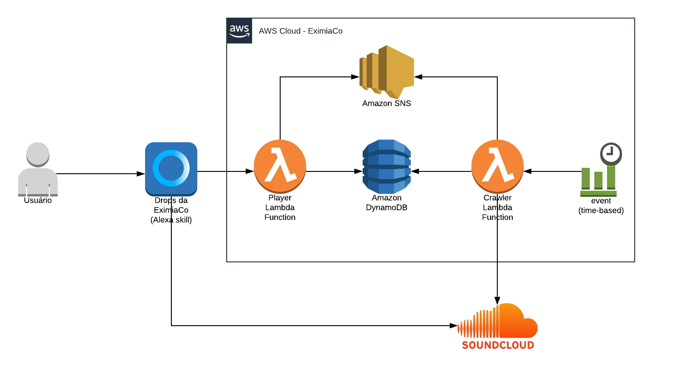

# Alexa Skill dos Drops da EximiaCo

Skill da Alexa desenvolvida pela EximiaCo para a reprodução do seu podcast, o "Drops da EximiaCo".

## Dependências

* [AWS SAM](https://aws.amazon.com/pt/serverless/sam/)
* [Python 3.7](https://www.python.org/downloads/release/python-370/)

## Arquitetura



### Componentes

* **Player Lambda Function:** Responsável por responder as solicitações da Alexa
* **Crawler Function:** Lambda responsável por obter o metadata dos episódios do feed RSS do SoundCloud, e atualizar no Amazon DynamoDB 
* **CloudWatch Events (event):** Evento agendado para iniciar a execução do Crawler 
* **Amazon SNS:** Tópico do Amazon SNS para notificar sobre problemas durante a execução
* **Amazon DynamoDB:** Armazena os metadados dos episódios do Drops 

## Deploy

Para efetuar o deploy do projeto:


```./deploy.sh <alexaSkillId> <samPackageBucketName> <snsTopicName>```

